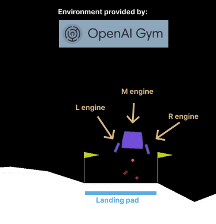
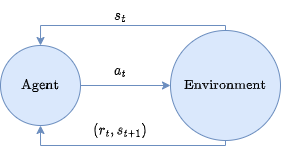
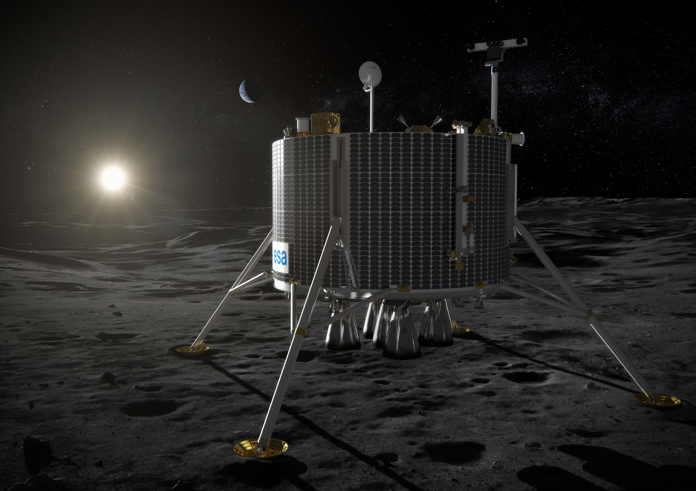

# **Solving Lunar Lander using Deep Reinforcement Learning**

Project proposal for AI course

Lemuel Puglisi, UniCT - 2023

---

# The problem

Design a **learning agent** that learns how to land the rocket inside the landing pad, by turning engines on and off.

---

# Action space

The action space is discrete:

- 0: do nothing
- 1: fire left orientation engine
- 2: fire main engine
- 3: fire right orientation engine

---

# Observation space

The state is an 8-dimensional vector: the coordinates of the lander in $(x,y)$, its linear velocities in $(x,y)$, its angle, its angular velocity, and two booleans that represent whether each leg is in contact with the ground or not.

---

# Starting state

The lander starts at the top center of the viewport with a random initial force applied to its center of mass.

---

<!-- _class: lead -->

# How does the agent learn?

---

# Reinforcement learning

At time $t$, the agent interacts with the environment, which has a state $s_t$, by performing an action $a_t$. The agent receives a reward $r_t$ based on the pair $(s_t, a_t)$ and the environment changes to a new state $s_{t+1}$. 

---

# Markov decision process

This process can be formalized as a Markov Decision Process $(S, A, P, R, \gamma)$ where:

+ $S$ is the set of the environment states
+ $A$ is the set of possible actions
+ $R$ is the reward distribution
+ $P$ is the transition distribution

--- 

# Policy

The action $a_t$ performed by the agent is determined by a function $\pi : S \to A$ called **policy**.

---

# Return

We want to find an optimal policy $\pi^*$, i.e. a policy that optimizes the return $R_{t_0}$

$$
R_{t_0} = \sum_{t=t_0}^{\infty} \gamma^{t - t_0} \cdot r_t
$$

Where $\gamma \in [0,1]$ is called **discount rate** and is used to balance the trade-off between short-term and long-term rewards

---

<!-- _class: lead -->

# What are the rewards for our agent?

---

# Lunar lander rewards (1)

For each step, the reward is:

+ decreased proportionally to the distance to the landing pad
+ decreased proportionally to the speed of the lander
+ increased by 10 points for each leg in contact with the ground
+ decreased by 0.03 when side engines are actioned
+ decreased by 0.3 when the main engine is actioned

---

# Lunar lander rewards (2)

The episode ends if the lander crashes or gets outside of the viewport. When an episode ends, the agent:

+ receives an additional reward of +100 for landing safely
+ receives an additional penalty (negative reward) of -100 for crashing the lander.

---

# Q-value function

Let $Q^*: S \times A \to \mathbb R$ be a function, called optimal Q-value function, that predicts the final return we will receive by choosing an action $a_t$ given a state $s_t$ and then proceeding with an optimal policy $\pi^*$. The $Q^*$ function satisfies the **Bellman equation**, thus can be written as: 

$$
Q^*(s,a) = r + \gamma Q^*(s', \pi^*(s')) 
$$

Where $s'$ is the next state given $(s,a)$. 

---

# Optimal policy

Given the Q-value function $Q^*$, defining the optimal policy is trivial:

$$
\pi^*(s) = \arg\max_a Q^*(s,a)
$$

---

# Deep Q-learning (1)

Deep Q-learning is about optimizing a deep neural network $Q_\theta$ that fits the real $Q^*$. The network parameters $\theta^{(0)}$ are initialized randomly and then optimized till convergency. One iteration consists of: (i) collecting experience $(s, a, r, s')$ in a memory, called **replay buffer**, by playing the agent for $m$ episodes in the simulator.

---

# Deep Q-learning (2)

(ii) sampling a batch $B$ of random experience $(s,a,r,s') \in B$ from the replay buffer and computing the **temporal difference error** $\mathcal L(\delta)$:

$$
\mathcal L(\delta) = Q_\theta(s,a) - 
(r + \gamma \max_a Q_\theta(s',a))
$$

By minimizing $\mathcal L(\delta)$ we force the Bellman equation:

$$
\begin{split}
0 = Q_\theta(s,a) - (r + \gamma \max_a Q_\theta(s',a)) \\
Q_\theta(s,a) = r + \gamma \max_a Q_\theta(s',a)
\end{split}
$$

---

# Deep Q-learning (3)

The parameters are optimized by minimizing the following loss function computed on the batch:

$$
\mathcal L = \frac{1}{|B|} \sum_{(s,a,r,s') \in B } \mathcal L (\delta)
$$

E.g. by using common optimizers like SGD. 

---

<!-- _class: lead -->

## Q.1 Can we get a working agent?

---

<!-- _class: lead -->

## Q.2 How many iterations are required for convergence?

---

<!-- _class: lead -->

## Q.3 What is the correlation between network depth and agent accuracy?

---

<!-- _class: invert -->

## Thank you!

