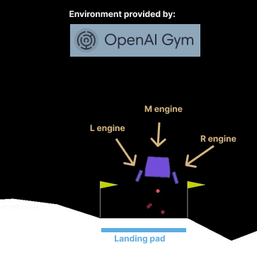

<style>
img[alt~="center"] {
  display: block;
  margin: 0 auto;
}

img[alt~="right"] {
  text-align: right; 
}
</style>

# **Solving Lunar Lander using Deep Reinforcement Learning**

 AI course

Lemuel Puglisi, UniCT - 2023

---



# The problem

Design a **learning agent** that learns how to land the rocket inside the landing pad, by turning engines on and off.

---

# The environment

- Partially observable
- Deterministic
- Sequential
- Static
- Continuous 
- Single-agent

---

# Action space

The action space is discrete:

- 0: do nothing
- 1: fire left orientation engine
- 2: fire main engine
- 3: fire right orientation engine

---

# Observation space

The state is an 8-dimensional vector: the coordinates of the lander in $(x,y)$, its linear velocities in $(x,y)$, its angle, its angular velocity, and two booleans that represent whether each leg is in contact with the ground or not.

---

# Starting state

The lander starts at the top center of the viewport with a random initial force applied to its center of mass.

---

# Rewards mechanism (1)


+ decreased proportionally to the distance to the landing pad
+ decreased proportionally to the speed of the lander
+ decreases proportionally to the angle w.r.t. the ground
+ increased by 10 points for each leg in contact with the ground
+ decreased by 0.03 when side engines are actioned
+ decreased by 0.3 when the main engine is actioned

---

# Reward mechanism (2)

The episode ends if the lander crashes or gets outside of the viewport. When an episode ends, the agent:

+ receives an additional reward of +100 for landing safely
+ receives an additional penalty (negative reward) of -100 for crashing the lander.


---

<!-- _class: lead -->

# How does the agent learn?

---

# Reinforcement learning

At time $t$, the agent interacts with the environment, which has a state $s_t$, by performing an action $a_t$. The agent receives a reward $r_t$ based on the pair $(s_t, a_t)$ and the environment changes to a new state $s_{t+1}$. 


---

# Markov decision process

This process can be formalized as a Markov Decision Process $(S, A, P, R, \gamma)$ where:

+ $S$ is the set of the environment states
+ $A$ is the set of possible actions
+ $R$ is the reward distribution
+ $P$ is the transition distribution

--- 

# Policy

The action $a_t$ performed by the agent is determined by a function $\pi : S \to A$ called **policy**. 

---

# Return

We want to find an optimal policy $\pi^*$, i.e. a policy that optimizes the return $R_{t_0}$

$$
R_t = \sum_{t'= t}^T \gamma^{(t' - t)} r_{t'}
$$

Where $\gamma \in [0,1]$ is called **discount rate** and is used to balance the trade-off between short-term and long-term rewards, and $T$ is the total number of steps.

---

# Optimal Q-value function

Let $Q^*: S \times A \to \mathbb R$ be a function, called optimal Q-value function, that predicts the final return we will receive by choosing an action $a_t$ given a state $s_t$ and then proceeding with an optimal policy $\pi^*$. The $Q^*$ function satisfies the **Bellman equation**, thus can be written as: 

$$
Q^*(s,a) = r + \gamma \max_{a'} Q^*(s', a')
$$

Where $s'$ is the next state given $(s,a)$. 

---

# Optimal policy

Given the Q-value function $Q^*$, defining the optimal policy is trivial:

$$
\pi^*(s) = \arg\max_a Q^*(s,a)
$$

--- 

# Deep Q-learning

Deep Q-learning tries to estimate the $Q^*(s, a)$ function using a parametrized function $Q(s, a; \theta)$ (i.e., a deep neural network). If we obtain $Q(s,a; \theta) \approx Q^*(s, a)$, then the agent policy will be set to: 

$$
\pi(s) = \arg\max_a Q(s,a; \theta)
$$ 

The algorithm can be divided in two phases, **collecting experience** and **learning**, repeated until convergence.

--- 

# Collecting experience

Collect experience $(s, a, r, s')$ in a memory, called **replay buffer** $D$, by playing the agent for $m$ episodes in the simulator.

---

# $\epsilon$-greedy policy

To perform better exploration, we adopt an $\epsilon$-greedy policy:

$$
    \pi_\epsilon(s) = \begin{cases}
    \text{random action } a & \text{ with probability } \epsilon \\
    \arg\max_{a \in A} Q(s, a; \theta_i) & \text{ with probability } 1 - \epsilon
    \end{cases}
$$

The $\epsilon$ value can be scheduled during the epochs, starting from a high value and decreasing it to strengthen the agent's strategy.

---

# Learning phase (1)

Sample a batch $B\subset D$ of random experience $(s,a,r,s') \in B$ from the replay buffer $D$ and computing the **temporal difference error** $\mathcal L$:

$$
\mathcal L(s, a, r, s', \theta_{t}) = Q(s,a; \theta_t) - 
(r + \gamma \max_a Q(s',a; \theta_{t-1}))
$$

By minimizing $\mathcal L$ we **force** the Bellman equation:

$$
\begin{split}
0 = Q(s,a, \theta_t) - (r + \gamma \max_a Q_(s',a; \theta_{t-1})) \\

Q(s,a, \theta_t) = (r + \gamma \max_a Q_(s',a; \theta_{t-1}))
\end{split}
$$

---

# Deep Q-learning (3)

The parameters are optimized by minimizing the following loss function computed on the batch:

$$
\mathcal J(\theta_t) = \frac{1}{|B|} \sum_{(s,a,r,s') \in B } \mathcal L(s, a, r, s', \theta_t) 
$$

E.g. by using common optimizers like SGD. 

---

# Avoiding catastrophic forgetting (1)

Did you notice that we use two different versions of $Q$ to compute the loss?

$$
\mathcal L(s, a, r, s', \theta_{t}) = Q(s,a; \theta_t) - 
(r + \gamma \max_a Q(s',a; \theta_{t-1}))
$$

$Q(\cdot, \cdot; \theta)$ is called the Q-network, while $Q(\cdot, \cdot; \theta_{t-1})$ is called the target network, and it is updated every $\tau$ batches with the weights of the Q-network.

---

# Avoiding catastrophic forgetting (2)

Using two networks mitigates the catastrophic forgetting phenomenon, i.e., forgetting skills learned in the past while learning new skills.

---

<!-- _class: lead -->

## Let's get our hands dirty

---

# Implementing the agent

The following pseudo-code gives an idea of how the agent is implemented:

```python
class LearningAgent:

  def __init__(self, q_network):
    self.q_network = q_network

  def policy(self, observations):
    best_action = argmax(self.q_network(observations))
    return best_action
```

---

# Q-network architecture


---

# $\epsilon$-scheduling

The $\epsilon$ value of the $\epsilon$-greedy policy is scheduler w.r.t. the current epoch $t$ using the following function: 

$$
\epsilon(t) = \max\left(0.1, 1 - \frac{2t}{E}\right)
$$

Where $E$ is the total number of epochs. 

--- 

# Training settings

+ Optimizer: Adam
+ Learning rate: $0.001$
+ Replay memory size: $5 \times 10^5$
+ Sync-rate $\tau$: every 10 batches 
+ Batch size: 512

---

# Winning the game

The game is considered to be won when the agent achieves a return of around 200. Our agent **surpassed this threshold** after approximately 35 epochs.

---

<!-- _class: lead -->

## Ablation study

---

# Ablation study: Capacity

The following figure shows the performance of the trained agent using a replay memory capacity of $5\times 10^5$, $5\times10^4$, and $5\times10^3$. We note that (1) performance increases proportionally with capacity; (2) if the capacity is not sufficient (red line), the agent's performance may degrade over time instead of improving (catastrophic forgetting).

---


---

# Ablation study: Sync-rate $\tau$

The training is repeated using different target network update frequencies. Generally, we observe that with a higher frequency, such as 1 update per batch (red line), there is a slower progression. By decreasing the update frequency, for example, 1 every 10 or 100 batches (blue or green line), we notice a faster progression and greater stability.

---


---

## Conclusions
The proposed algorithm can solve the Lunar Lander problem by learning an optimal strategy in a limited number of iterations. However, it also presents some limitations, such as difficulty in defining the reward function and managing the algorithm's hyperparameters, which play a fundamental role. Currently, Deep Reinforcement Learning is becoming more widely used due to its flexibility in addressing a variety of problems.

---

<!-- _class: lead -->

## Open-Source Implementation

---


---

# Training the agent

```bash

(your_env) <Lunar-Lander-DQN> python train.py --help

usage: train.py [-h] [--dest DEST] [--epochs EPOCHS] [--episodes EPISODES] [--batch-size BATCH_SIZE] [--capacity CAPACITY]
                [--sync-rate SYNC_RATE]

optional arguments:
  -h, --help                show this help message and exit
  --dest DEST               destination folder
  --epochs EPOCHS           number of epochs
  --episodes EPISODES       number of episodes to play in an epoch
  --batch-size BATCH_SIZE   batch size on trainin phase
  --capacity CAPACITY       capacity of the replay memory
  --sync-rate SYNC_RATE     sync rate of the target network

```

---

# Agent in action

```bash

(your_env) <Lunar-Lander-DQN> python play.py --help

usage: play.py [-h] [--model-ckpt MODEL_CKPT] [--episodes EPISODES]

optional arguments:
  -h, --help            show this help message and exit
  --model-ckpt MODEL_CKPT
  --episodes EPISODES

```

---


<!-- _class: invert -->

## Thank you!


